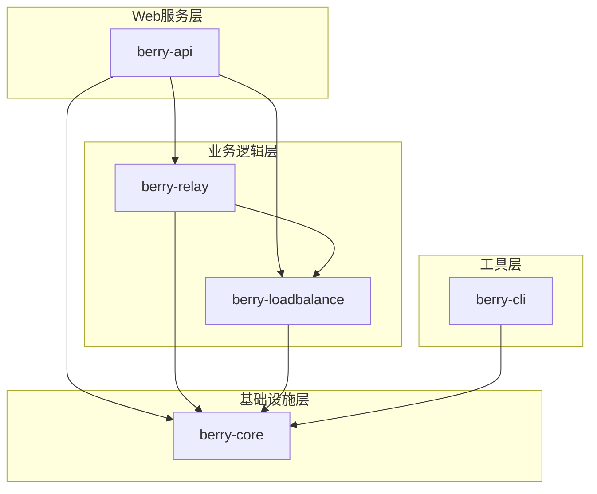
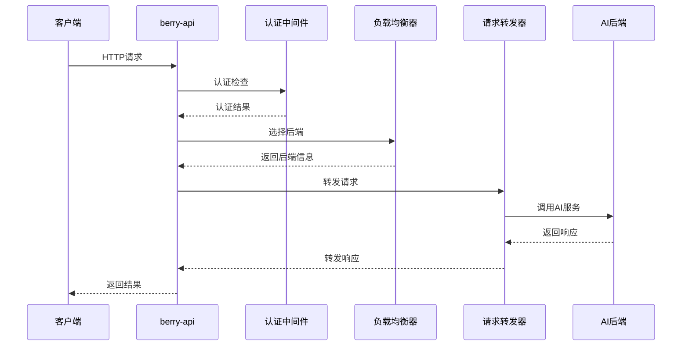
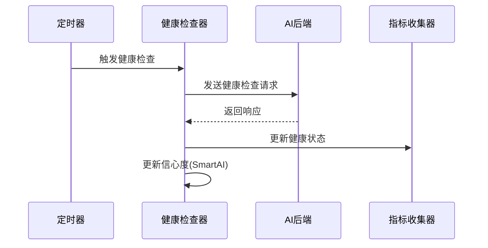

# Berry API 架构文档

## 📁 项目结构

```
berry-api/
├── berry-api/              # Web服务层
│   ├── src/
│   │   ├── app.rs          # 应用状态和启动逻辑
│   │   ├── lib.rs          # 库入口
│   │   ├── main.rs         # 主程序入口
│   │   ├── router/         # 路由处理
│   │   │   ├── admin.rs    # 管理接口
│   │   │   ├── chat.rs     # 聊天完成接口
│   │   │   ├── health.rs   # 健康检查
│   │   │   ├── metrics.rs  # 指标接口
│   │   │   ├── models.rs   # 模型列表接口
│   │   │   ├── router.rs   # 路由配置
│   │   │   └── smart_ai.rs # SmartAI接口
│   │   ├── static_files.rs # 静态文件服务
│   │   └── observability/  # 可观测性
│   │       └── prometheus_metrics.rs
│   ├── build.rs            # 构建脚本
│   └── Cargo.toml
├── berry-cli/              # 命令行工具
│   ├── src/
│   │   └── main.rs         # CLI主程序
│   └── Cargo.toml
├── berry-core/             # 核心库
│   ├── src/
│   │   ├── auth/           # 认证系统
│   │   │   ├── middleware.rs # 认证中间件
│   │   │   ├── rate_limit.rs # 速率限制
│   │   │   └── types.rs    # 认证类型
│   │   ├── config/         # 配置管理
│   │   │   ├── loader.rs   # 配置加载器
│   │   │   └── model.rs    # 配置模型
│   │   └── lib.rs          # 库入口
│   └── Cargo.toml
├── berry-loadbalance/      # 负载均衡层
│   ├── src/
│   │   └── loadbalance/
│   │       ├── health_checker.rs    # 健康检查器
│   │       ├── manager.rs           # 负载均衡管理器
│   │       ├── selector.rs          # 后端选择器
│   │       ├── service.rs           # 负载均衡服务
│   │       ├── smart_ai_health.rs   # SmartAI健康检查
│   │       └── mod.rs
│   └── Cargo.toml
├── berry-relay/            # 请求转发层
│   ├── src/
│   │   └── relay/
│   │       ├── client/     # 客户端实现
│   │       │   ├── factory.rs       # 客户端工厂
│   │       │   ├── openai.rs        # OpenAI客户端
│   │       │   ├── unified.rs       # 统一客户端
│   │       │   └── mod.rs
│   │       ├── handler/    # 请求处理器
│   │       │   ├── loadbalanced.rs  # 负载均衡处理器
│   │       │   ├── types.rs         # 处理器类型
│   │       │   └── mod.rs
│   │       └── mod.rs
│   └── Cargo.toml
├── config/                 # 配置文件目录
│   └── smart_ai_example.toml # SmartAI配置示例
├── public/                 # 静态文件
│   ├── index.html          # 状态页面
│   └── _next/              # Next.js构建文件
├── dev_tmp/                # 开发临时文件
│   ├── config.toml         # 开发配置
│   └── config_ai.toml      # AI配置
├── docker-compose.yml      # Docker编排
├── Dockerfile              # Docker镜像
├── Cargo.toml              # 工作空间配置
├── Cargo.lock              # 依赖锁定
├── LICENSE                 # 许可证
├── README.md               # 项目文档
└── ARCHITECTURE.md         # 架构文档
```

## 🏗️ 模块依赖关系



## 🔄 数据流向

### 请求处理流程



### 健康检查流程



## 🧩 核心组件详解

### berry-core (核心库)

**职责**：
- 配置文件解析和验证
- 用户认证和权限管理
- 共享数据结构定义
- 工具函数和常量

**关键文件**：
- `config/model.rs`: 配置数据模型
- `auth/middleware.rs`: 认证中间件
- `auth/rate_limit.rs`: 速率限制

### berry-loadbalance (负载均衡层)

**职责**：
- 实现多种负载均衡策略
- 后端健康状态管理
- 性能指标收集
- SmartAI智能选择

**关键文件**：
- `selector.rs`: 负载均衡策略实现
- `health_checker.rs`: 健康检查逻辑
- `smart_ai_health.rs`: SmartAI健康管理

### berry-relay (请求转发层)

**职责**：
- HTTP请求转发
- 流式响应处理
- 错误处理和重试
- 协议适配

**关键文件**：
- `handler/loadbalanced.rs`: 负载均衡处理器
- `client/unified.rs`: 统一客户端接口
- `client/openai.rs`: OpenAI客户端实现

### berry-api (Web服务层)

**职责**：
- HTTP路由和中间件
- API接口实现
- 静态文件服务
- 可观测性集成

**关键文件**：
- `router/router.rs`: 路由配置
- `router/chat.rs`: 聊天接口
- `app.rs`: 应用启动逻辑

### berry-cli (命令行工具)

**职责**：
- 配置文件验证
- 健康检查工具
- 运维管理功能
- 测试工具

## 🔧 扩展点

### 1. 新增负载均衡策略

在 `berry-loadbalance/src/loadbalance/selector.rs` 中：

```rust
// 1. 在LoadBalanceStrategy枚举中添加新策略
#[derive(Debug, Deserialize, Serialize, Clone, PartialEq)]
#[serde(rename_all = "snake_case")]
pub enum LoadBalanceStrategy {
    // ... 现有策略
    YourNewStrategy,
}

// 2. 在BackendSelector中实现选择逻辑
impl BackendSelector {
    pub async fn select_backend(&self) -> Result<Backend> {
        match self.mapping.strategy {
            // ... 现有策略
            LoadBalanceStrategy::YourNewStrategy => {
                self.select_your_new_strategy(&filtered_backends)
            }
        }
    }
    
    fn select_your_new_strategy(&self, backends: &[Backend]) -> Result<Backend> {
        // 实现你的策略逻辑
    }
}
```

### 2. 新增认证方式

在 `berry-core/src/auth/` 中添加新的认证实现：

```rust
// 新增认证类型
pub enum AuthType {
    Bearer,
    ApiKey,
    YourNewAuth,
}

// 实现认证逻辑
impl AuthMiddleware {
    pub fn authenticate_your_way(&self, request: &Request) -> Result<User> {
        // 实现认证逻辑
    }
}
```

### 3. 新增AI后端支持

在 `berry-relay/src/relay/client/` 中：

```rust
// 1. 实现新的客户端
pub struct YourAIClient {
    // 客户端字段
}

impl AIBackendClient for YourAIClient {
    // 实现接口方法
}

// 2. 在工厂中注册
impl ClientFactory {
    pub fn create_client(&self, backend_type: &ProviderBackendType) -> Box<dyn AIBackendClient> {
        match backend_type {
            // ... 现有类型
            ProviderBackendType::YourAI => Box::new(YourAIClient::new()),
        }
    }
}
```

## 📊 性能考虑

### 内存使用

- **配置缓存**: 配置在内存中缓存，支持热重载
- **连接池**: HTTP客户端使用连接池复用连接
- **流式处理**: 大响应使用流式处理，避免内存积累

### 并发处理

- **异步架构**: 基于Tokio的异步处理
- **无锁设计**: 使用Arc和RwLock最小化锁竞争
- **背压控制**: 实现请求队列和背压机制

### 扩展性

- **无状态设计**: 服务无状态，支持水平扩展
- **配置外部化**: 配置文件外部化，支持动态更新
- **插件化架构**: 模块化设计，支持功能扩展
