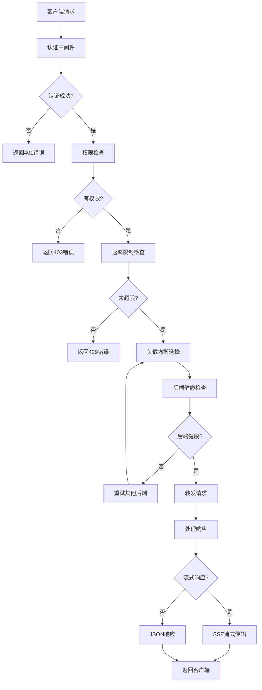

# Berry API - 智能AI负载均衡网关

[](https://www.rust-lang.org)
[](LICENSE)
[](Dockerfile)
[](https://platform.openai.com/docs/api-reference)

Berry API 是一个高性能、生产就绪的AI服务负载均衡网关，专为多AI提供商环境设计。它提供智能负载均衡、自动故障转移、健康检查和成本优化功能，完全兼容OpenAI API格式。

## ✨ 核心特性

- **智能负载均衡**: 支持加权随机、轮询、最低延迟、故障转移、SmartAI等8种策略。
- **智能健康检查**: 差异化检查策略，自动故障恢复和熔断机制。
- **企业级认证**: 基于Bearer Token的用户认证、细粒度权限控制和速率限制。
- **高性能架构**: 基于Tokio的异步处理、流式支持、连接保活和配置热重载。
- **可观测性**: 提供Prometheus指标、结构化日志和健康检查端点。

## 📚 文档导航

所有详细文档都已迁移至 `docs/` 目录。

- **[🚀 快速开始](docs/quickstart.md)**: 5分钟部署运行指南。
- **[⚙️ 配置指南](docs/configuration.md)**: 详细的配置文件结构和参数说明。
- **[🔌 API 使用指南](docs/api-guide.md)**: 兼容OpenAI API的接口使用说明。
- **[⚖️ 负载均衡策略](docs/load-balancing-strategies.md)**: 深入了解各种负载均衡策略。
- **[🛣️ 路由选择器概览](docs/route-selector-overview.md)**: 新的简化负载均衡接口概览和快速开始。
- **[🏗️ 路由选择器设计](docs/route-selector-design.md)**: 详细的设计思路和架构说明。
- **[📁 路由选择器模块结构](docs/route-selector-module-structure.md)**: 模块化代码组织和使用方式。
- **[⚡ 路由选择器功能特性](docs/route-selector-features.md)**: 完整的功能介绍，包括强制后端选择。
- **[🔄 路由选择器迁移指南](docs/route-selector-migration.md)**: 从传统接口迁移到路由选择器。
- **[📋 路由选择器实现总结](docs/route-selector-implementation.md)**: 实现细节和验证结果。
- **[🏥 健康检查与故障处理](docs/health-checks-and-fault-handling.md)**: 健康检查机制和故障转移流程。
- **[🛠️ 命令行工具 (berry-cli)](docs/cli-tool.md)**: 运维管理工具的使用。
- **[📈 性能优化与部署](docs/performance-optimization.md)**: 性能调优建议和生产部署指南。
- **[📊 监控与可观测性](docs/monitoring-and-observability.md)**: Prometheus集成、日志管理和告警配置。
- **[🔧 故障排除](docs/troubleshooting.md)**: 常见问题诊断和解决方案。
- **[🏗️ 架构设计](docs/architecture.md)**: 系统架构和组件设计。
- **[🤝 贡献指南](docs/contributing.md)**: 开发环境设置和贡献流程。
- **[🐳 Docker 构建指南](docs/docker-build.md)**: 详细的Docker构建方式。

## 🚀 快速开始

请参阅 [快速开始指南](docs/quickstart.md) 获取详细的部署和运行说明。

## 🏗️ 系统架构

Berry API 采用模块化架构设计，由5个核心模块组成：

```
┌──────────────────────────────────────────────────────────────────┐
│                        Berry API Gateway                         │
├─────────────────┬─────────────────┬──────────────────┬───────────┤
│   berry-api     │  berry-relay    │ berry-loadbalance│berry-core │
│   Web服务层     │   请求转发层    │   负载均衡层     │  核心库   │
│                 │                 │                  │           │
│ • HTTP路由      │ • 请求转发      │ • 后端选择       │ • 配置管理│
│ • 认证中间件    │ • 流式处理      │ • 健康检查       │ • 认证系统│
│ • 静态文件      │ • 错误处理      │ • 指标收集       │ • 共享类型│
│ • 管理接口      │ • 协议适配      │ • 策略实现       │ • 工具函数│
└─────────────────┴─────────────────┴──────────────────┴───────────┘
                                │
                    ┌───────────┴───────────┐
                    │      berry-cli        │
                    │     命令行工具        │
                    │                       │
                    │ • 配置验证            │
                    │ • 健康检查            │
                    │ • 指标查看            │
                    │ • 后端测试            │
                    └───────────────────────┘
```

### 🔄 请求处理流程



## 许可证

本项目采用 GPL-3.0 许可证。详情请参阅 [LICENSE](LICENSE) 文件。