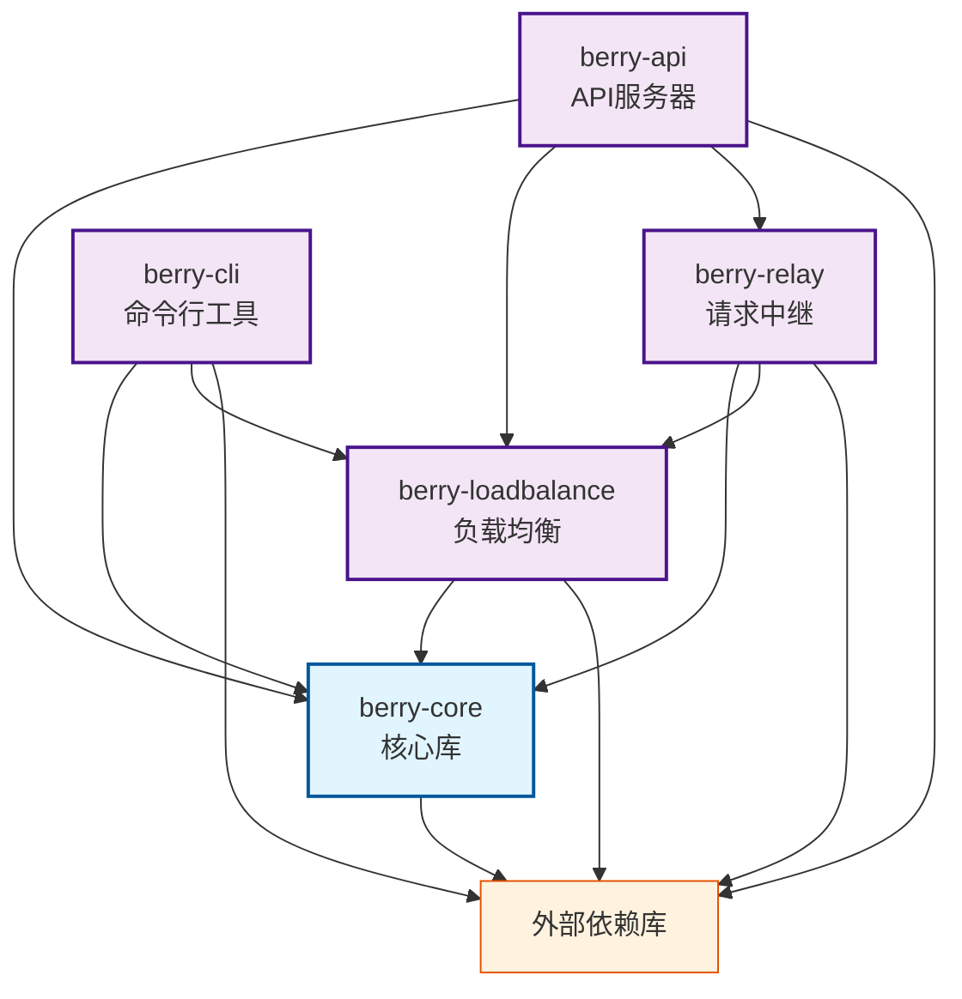
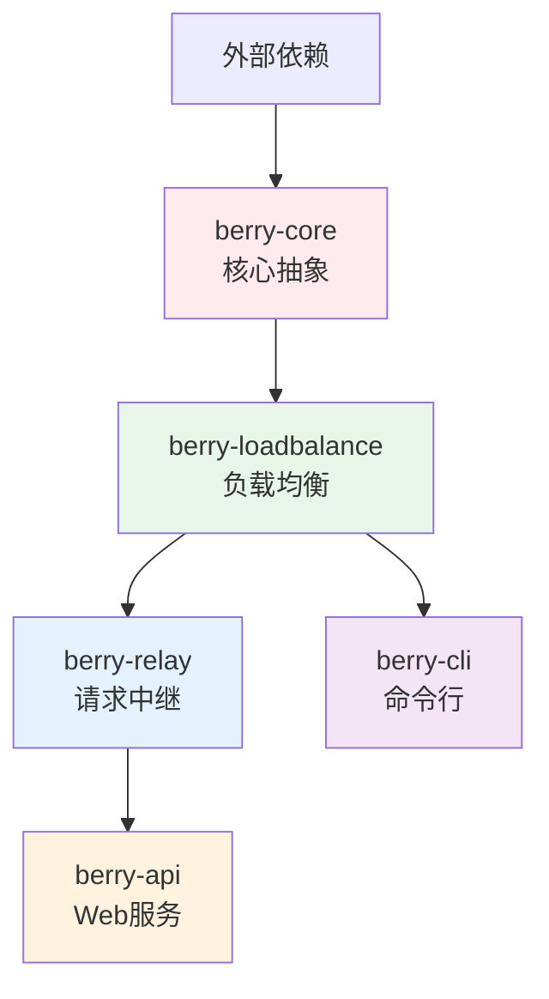

# Berry API 依赖关系图

## 模块依赖关系

## 外部依赖详细分析

### berry-core 依赖

- anyhow - 错误处理
- async-trait - 异步 trait 支持
- serde/serde_json - 序列化
- thiserror - 自定义错误类型
- tokio - 异步运行时
- toml - 配置文件解析
- tracing - 日志跟踪
- chrono - 时间处理
- axum/axum-extra - Web 框架
- headers - HTTP 头处理
- reqwest - HTTP 客户端

### berry-loadbalance 依赖

- **内部依赖**: berry-core
- anyhow, async-trait, serde, thiserror, tokio, tracing, chrono, reqwest
- rand - 随机数生成
- futures - 异步流处理
- once_cell - 全局变量
- parking_lot - 并发原语

### berry-relay 依赖

- **内部依赖**: berry-core, berry-loadbalance
- anyhow, async-trait, axum, axum-extra, bytes, chrono, futures, headers, reqwest, serde, thiserror, tokio, tracing
- eventsource-stream - SSE 流处理
- tokio-stream, tokio-util - 流处理工具

### berry-api 依赖

- **内部依赖**: berry-core, berry-loadbalance, berry-relay
- anyhow, axum, axum-extra, chrono, headers, serde, serde_json, tokio, tower-http, tracing, tracing-subscriber
- include_dir - 静态文件嵌入
- mime_guess - MIME 类型猜测
- prometheus, axum-prometheus - 监控指标（可选）

### berry-cli 依赖

- **内部依赖**: berry-core, berry-loadbalance
- anyhow, clap, reqwest, serde, serde_json, tokio, tracing, tracing-subscriber

## 依赖层级结构

