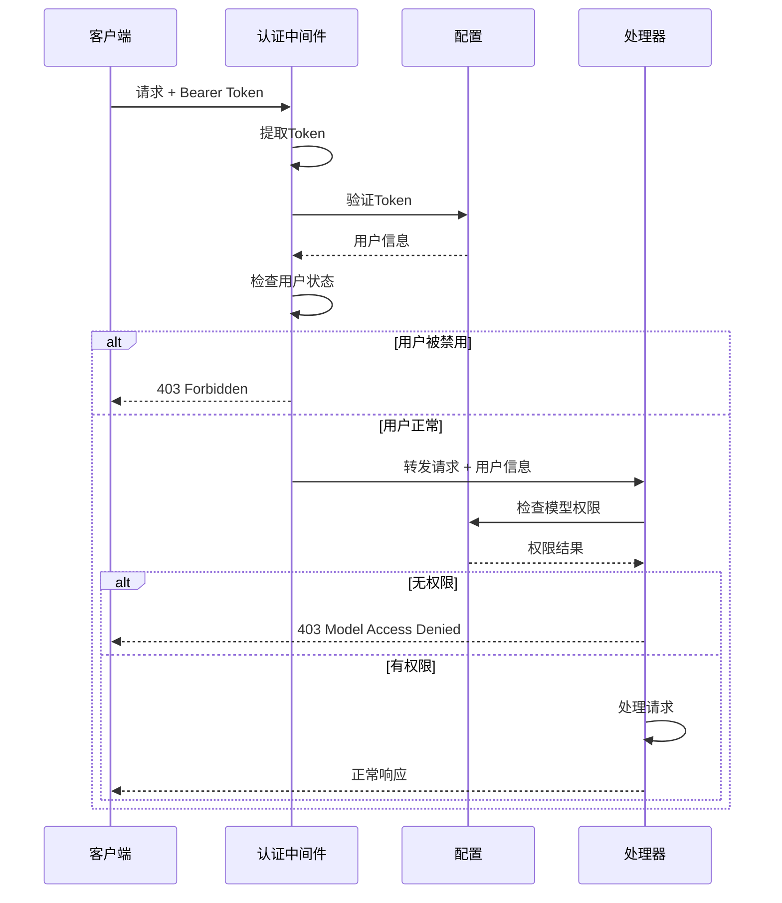

# Berry API 架构设计文档

## 1. 系统概述

Berry API 是一个高性能的AI服务负载均衡网关，提供智能的后端选择、健康检查、故障转移和请求转发功能。系统采用模块化设计，支持多种负载均衡策略和认证机制。

## 2. 核心模块架构

### 2.1 模块组织结构

```
api/src/
├── app.rs                    # 应用入口和状态管理
├── config/                   # 配置管理模块
│   ├── model.rs             # 配置数据结构
│   └── loader.rs            # 配置加载器
├── auth/                     # 认证模块
│   ├── middleware.rs        # 认证中间件
│   └── types.rs             # 认证类型定义
├── loadbalance/             # 负载均衡模块
│   ├── service.rs           # 负载均衡服务
│   ├── manager.rs           # 负载均衡管理器
│   ├── selector.rs          # 后端选择器
│   └── health_checker.rs    # 健康检查器
├── relay/                   # 请求转发模块
│   ├── handler/             # 请求处理器
│   └── client/              # 客户端实现
├── router/                  # 路由模块
│   ├── router.rs            # 路由配置
│   ├── chat.rs              # 聊天API路由
│   ├── health.rs            # 健康检查路由
│   ├── metrics.rs           # 指标路由
│   └── models.rs            # 模型列表路由
└── static_files.rs          # 静态文件服务
```

## 3. 详细时序图

### 3.1 系统启动时序图


### 3.2 请求处理完整时序图


### 3.3 负载均衡选择时序图


### 3.4 健康检查时序图


### 3.5 配置热重载时序图


### 3.6 错误处理和重试时序图


## 4. 模块职责详解

### 4.1 应用层 (app.rs)
- **AppState**: 管理全局应用状态，包括负载均衡服务、处理器和配置
- **生命周期管理**: 负责服务的启动和优雅关闭
- **依赖注入**: 为各个组件提供共享的状态和配置

### 4.2 配置模块 (config/)
- **Config结构**: 定义完整的配置数据结构
- **Provider配置**: AI服务提供商的连接信息和认证
- **Model映射**: 自定义模型到Provider模型的映射关系
- **用户管理**: 用户认证和权限配置
- **全局设置**: 超时、重试、健康检查等全局参数

### 4.3 认证模块 (auth/)
- **Bearer Token认证**: 基于HTTP Authorization头的认证
- **用户权限验证**: 检查用户对特定模型的访问权限
- **中间件集成**: 与Axum框架的中间件系统集成
- **错误处理**: 标准化的认证错误响应

### 4.4 负载均衡模块 (loadbalance/)
- **LoadBalanceService**: 负载均衡的主服务接口
- **LoadBalanceManager**: 管理所有模型的选择器
- **BackendSelector**: 实现具体的负载均衡策略
- **HealthChecker**: 定期检查后端健康状态
- **MetricsCollector**: 收集性能指标和健康状态

### 4.5 转发模块 (relay/)
- **LoadBalancedHandler**: 负载均衡的请求处理器
- **OpenAIClient**: OpenAI兼容的HTTP客户端
- **请求转换**: 处理请求格式转换和模型名称映射
- **响应处理**: 支持流式和非流式响应

### 4.6 路由模块 (router/)
- **路由配置**: 定义所有API端点
- **请求分发**: 将请求分发到相应的处理器
- **中间件集成**: 集成认证、日志等中间件
- **静态文件服务**: 提供监控界面的静态文件

## 5. 关键设计特性

### 5.1 负载均衡策略
- **WeightedRandom**: 基于权重的随机选择
- **RoundRobin**: 轮询选择
- **LeastLatency**: 选择延迟最低的后端
- **Failover**: 优先级故障转移
- **SmartWeightedFailover**: 智能权重故障转移

### 5.2 健康检查机制
- **主动检查**: 定期发送API请求验证后端状态
- **被动验证**: 基于实际请求结果更新健康状态
- **计费模式感知**: 根据计费模式选择检查策略
- **恢复验证**: 不健康后端的恢复检查

### 5.3 错误处理
- **多层重试**: 请求级别和后端级别的重试机制
- **故障隔离**: 快速识别和隔离故障后端
- **优雅降级**: 在部分后端不可用时继续服务
- **详细错误信息**: 提供有用的错误诊断信息

### 5.4 性能优化
- **异步架构**: 全异步处理提高并发性能
- **连接复用**: HTTP客户端连接池
- **指标收集**: 实时性能监控
- **内存效率**: 优化的数据结构和算法

## 6. 高级时序图

### 6.1 流式响应处理时序图


### 6.2 权重恢复机制时序图


### 6.3 并发请求处理时序图


### 6.4 监控和指标收集时序图


## 7. 数据流图

### 7.1 配置数据流


### 7.2 请求数据流


## 8. 组件交互图

### 8.1 核心组件关系图


### 8.2 数据存储和状态管理


## 9. 安全架构

### 9.1 认证授权流程



### 9.2 API密钥管理


## 10. 性能和可扩展性

### 10.1 性能优化策略

- **异步I/O**: 使用Tokio异步运行时，支持高并发
- **连接池**: HTTP客户端连接复用，减少连接开销
- **内存管理**: 使用Arc和RwLock实现高效的共享状态
- **负载均衡**: 智能后端选择，避免热点问题
- **缓存策略**: 配置和健康状态的内存缓存

### 10.2 可扩展性设计

- **模块化架构**: 各组件松耦合，易于扩展和维护
- **插件化策略**: 负载均衡策略可插拔
- **配置驱动**: 通过配置文件控制行为，无需代码修改
- **水平扩展**: 支持多实例部署和负载分担

### 10.3 监控和观测性

- **结构化日志**: 使用tracing框架提供详细日志
- **指标收集**: 实时性能和健康指标
- **健康检查**: 多层次的健康状态监控
- **错误追踪**: 详细的错误信息和调用链