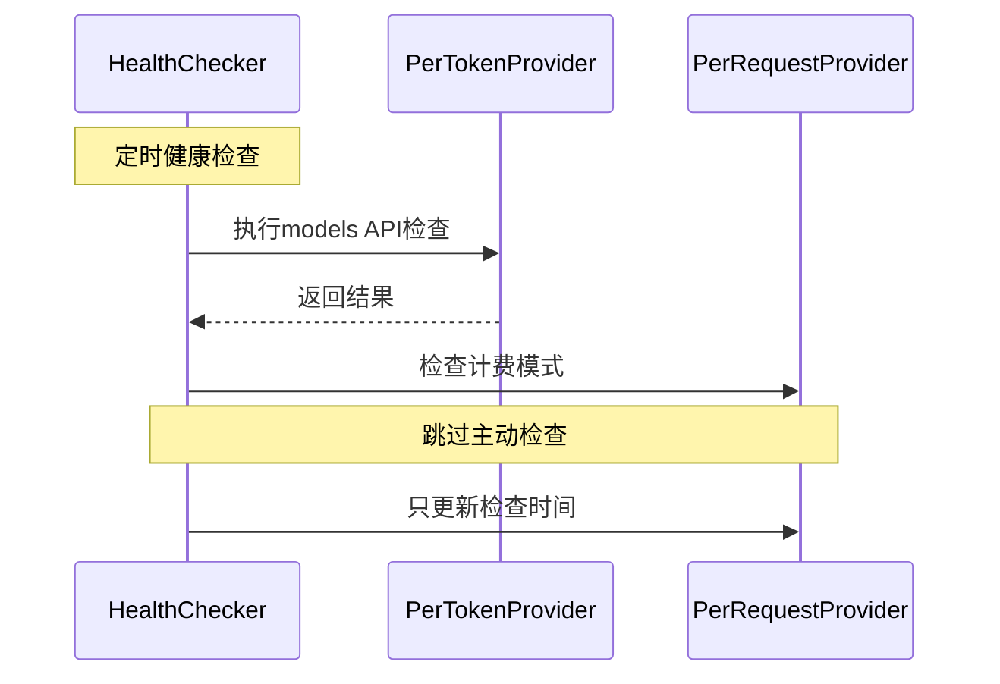
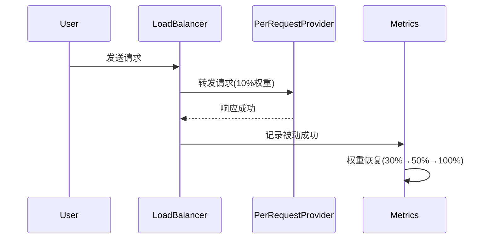

# 智能健康检查机制

## 概述

Berry API 现在支持基于Backend级别计费模式的智能健康检查机制，能够根据不同模型的计费模式采用不同的健康检查策略，有效降低成本并提高系统可靠性。

## 核心特性

### 1. Backend级别计费模式区分

#### 按Token计费 (PerToken)
- **主动健康检查**: 定期执行models API检查和chat请求验证
- **恢复机制**: 使用chat请求进行主动恢复验证
- **适用场景**: OpenAI GPT-4、Anthropic Claude等按token计费的模型

#### 按请求计费 (PerRequest)
- **被动验证**: 跳过主动健康检查，依赖实际请求结果
- **权重恢复**: 不健康时降至10%权重，成功请求后逐步恢复
- **适用场景**: 按请求次数计费的昂贵专有模型

### 2. 权重恢复机制

按请求计费的provider在失败后会进入权重恢复流程：

```
失败 → 10%权重 → 成功1-2次 → 30%权重 → 成功3-4次 → 50%权重 → 成功5+次 → 100%权重
```

### 3. 智能负载均衡策略

新增 `SmartWeightedFailover` 策略，支持：
- 动态权重调整
- 混合计费模式处理
- 智能故障转移

## 配置示例

### Provider配置

```toml
# Provider配置不再包含计费模式，计费模式现在在Backend级别配置
[providers.openai]
name = "OpenAI"
base_url = "https://api.openai.com/v1"
api_key = "sk-your-key"
models = ["gpt-4", "gpt-3.5-turbo", "premium-gpt-4"]
enabled = true

[providers.custom_provider]
name = "Custom Provider"
base_url = "https://api.custom.com/v1"
api_key = "your-key"
models = ["custom-model", "expensive-model"]
enabled = true
```

### 模型映射配置

```toml
[models.smart_gpt4]
name = "smart-gpt-4"
strategy = "smart_weighted_failover"  # 智能权重故障转移
enabled = true

[[models.smart_gpt4.backends]]
provider = "openai"
model = "gpt-4"
weight = 0.5  # 主要backend
priority = 1
enabled = true
billing_mode = "per_token"  # 按token计费 - 执行主动健康检查

[[models.smart_gpt4.backends]]
provider = "openai"
model = "premium-gpt-4"
weight = 0.3  # 昂贵模型，按请求计费
priority = 2
enabled = true
billing_mode = "per_request"  # 按请求计费 - 跳过主动检查，使用被动验证

[[models.smart_gpt4.backends]]
provider = "custom_provider"
model = "expensive-model"
weight = 0.2  # 备用backend，支持权重恢复
priority = 3
enabled = true
billing_mode = "per_request"  # 按请求计费 - 跳过主动检查，使用被动验证
```

## 工作流程

### 健康检查流程



### 被动验证流程



## API使用

### 记录请求结果

```rust
// 成功请求
service.record_request_result(
    "provider_name",
    "model_name",
    RequestResult::Success { latency: Duration::from_millis(500) }
).await;

// 失败请求
service.record_request_result(
    "provider_name", 
    "model_name",
    RequestResult::Failure { error: "API Error".to_string() }
).await;
```

### 获取有效权重

```rust
let metrics = service.get_metrics();
let effective_weight = metrics.get_effective_weight("provider:model", 1.0);
println!("当前有效权重: {}", effective_weight);
```

## 运行演示

### 1. 基本演示

```bash
cargo run --example smart_health_check_demo
```

### 2. 使用配置文件

```bash
# 复制示例配置
cp config_smart_health_check.toml config.toml

# 启动服务
RUST_LOG=debug cargo run
```

## 监控和调试

### 日志级别

```bash
# 查看健康检查详情
RUST_LOG=berry_api_api::loadbalance::health_checker=debug cargo run

# 查看权重恢复过程
RUST_LOG=berry_api_api::loadbalance::selector=debug cargo run

# 查看完整调试信息
RUST_LOG=debug cargo run
```

### 关键日志信息

- `Provider {} uses per-token billing, performing active health check`
- `Provider {} uses per-request billing, skipping active health check`
- `Recording passive success for per-request provider`
- `Backend {} advanced to stage {:?} with weight {:.2}`

## 最佳实践

### 1. 计费模式选择

- **按token计费**: 适用于OpenAI GPT-4、Anthropic Claude等按token计费的模型
- **按请求计费**: 适用于昂贵的专有模型或按调用次数计费的服务

### 2. Backend配置

- 主要backend设置较高权重(0.5-0.8)
- 按请求计费的备用backend设置较低权重(0.2-0.4)
- 确保同一模型下所有backend权重总和为1.0
- 同一Provider可以同时支持不同计费模式的模型

### 3. 监控建议

- 监控权重恢复过程
- 跟踪被动验证成功率
- 观察不同计费模式的健康检查行为
- 关注同一Provider下不同模型的健康状态

## 故障排除

### 常见问题

1. **按请求计费provider权重不恢复**
   - 检查是否正确调用`record_request_result`
   - 确认计费模式配置正确

2. **主动健康检查仍在执行**
   - 验证`billing_mode`配置
   - 检查provider配置是否生效

3. **权重恢复过慢**
   - 调整成功请求阈值
   - 检查被动验证逻辑

### 调试步骤

1. 启用debug日志
2. 检查provider配置
3. 验证计费模式设置
4. 监控权重变化
5. 查看健康检查日志

## 技术实现

### 核心组件

- `BillingMode`: 计费模式枚举
- `WeightRecoveryState`: 权重恢复状态管理
- `SmartWeightedFailover`: 智能权重故障转移策略
- `record_passive_success`: 被动验证记录方法

### 扩展点

- 自定义权重恢复阶段
- 可配置的恢复阈值
- 更多计费模式支持
- 高级监控指标