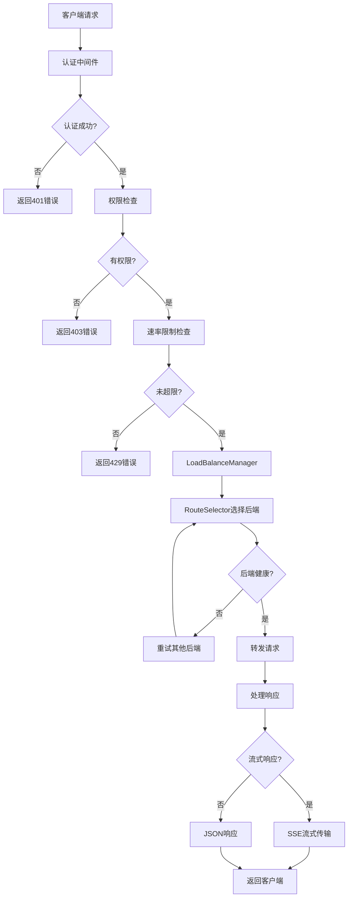

# 🏛️ 架构设计

Berry API 采用模块化架构设计，由5个核心模块组成：

```
┌─────────────────────────────────────────────────────────────────┐
│                        Berry API Gateway                        │
├─────────────────┬─────────────────┬─────────────────┬───────────┤
│   berry-api     │  berry-relay    │ berry-loadbalance│berry-core │
│   Web服务层     │   请求转发层    │   负载均衡层     │  核心库   │
│                 │                 │                 │           │
│ • HTTP路由      │ • 请求转发      │ • RouteSelector │ • 配置管理│
│ • 认证中间件    │ • 流式处理      │ • 后端选择      │ • 认证系统│
│ • 静态文件      │ • 错误处理      │ • 健康检查      │ • 共享类型│
│ • 管理接口      │ • 协议适配      │ • 指标收集      │ • 工具函数│
│                 │                 │ • 策略实现      │           │
└─────────────────┴─────────────────┴─────────────────┴───────────┘
                                │
                    ┌───────────┴───────────┐
                    │      berry-cli        │
                    │     命令行工具        │
                    │                       │
                    │ • 配置验证            │
                    │ • 健康检查            │
                    │ • 指标查看            │
                    │ • 后端测试            │
                    └───────────────────────┘
```

### 🔄 请求处理流程



### 🔄 RouteSelector 组件详解

`RouteSelector` 是 `berry-loadbalance` 模块中的核心组件，负责根据请求的模型名称和可选的用户标签，智能地选择最合适的后端服务。它替代了旧的 `ConcreteLoadBalancedHandler` 中直接进行后端选择的逻辑，将选择职责从请求处理层解耦，提升了系统的灵活性和可维护性。

#### 与 LoadBalanceManager 的集成

`RouteSelector` 实例由 `LoadBalanceManager` 管理。`LoadBalanceManager` 在启动时会根据配置为每个启用的模型创建一个 `BackendSelector`（即 `RouteSelector` 的内部实现）实例。当 `berry-relay` 模块接收到请求并需要选择后端时，它会调用 `LoadBalanceManager` 的 `select_backend` 或 `select_backend_with_user_tags` 方法。`LoadBalanceManager` 随后会找到对应模型的 `RouteSelector` 实例，并委托其执行实际的后端选择逻辑。

这种集成方式确保了：
-   **集中管理**: 所有模型的后端选择逻辑都通过 `LoadBalanceManager` 统一入口进行管理。
-   **职责分离**: `LoadBalanceManager` 负责管理和协调 `RouteSelector` 实例，而 `RouteSelector` 则专注于执行复杂的选择算法。
-   **可扩展性**: 方便未来引入新的选择策略或后端类型，只需在 `RouteSelector` 内部实现或扩展 `LoadBalanceManager` 的管理逻辑。

#### 新的路由选择流程

引入 `RouteSelector` 后，请求处理流程中的路由选择步骤变得更加精细和智能：

1.  **请求接收**: `berry-relay` 接收到客户端请求，并提取模型名称和用户标签（如果存在）。
2.  **委托选择**: `berry-relay` 将模型名称和用户标签传递给 `LoadBalanceManager`。
3.  **选择器查找**: `LoadBalanceManager` 根据模型名称查找对应的 `RouteSelector` 实例。
4.  **后端过滤**: `RouteSelector` 首先根据用户标签对配置的后端列表进行过滤，确保只考虑符合用户权限或偏好的后端。
5.  **智能选择**: `RouteSelector` 运用其内部的智能算法（如 `SmartAI` 策略）评估过滤后的后端，考虑健康状态、性能指标、信心度等因素。
6.  **返回最佳后端**: `RouteSelector` 返回一个 `SelectedBackend` 对象，其中包含选定的后端信息及其选择耗时。
7.  **请求转发**: `berry-relay` 使用选定的后端信息构建并转发请求到上游服务。
8.  **结果记录**: 请求完成后，`berry-relay` 将请求结果（成功/失败、延迟等）反馈给 `LoadBalanceManager`，由其更新 `RouteSelector` 内部的指标数据，用于后续的智能选择。

#### 与 SmartAI 算法的集成点

`RouteSelector` 深度集成了 `SmartAI` 算法，以实现更智能和自适应的负载均衡。`SmartAI` 算法通过 `MetricsCollector` 收集的实时数据来评估每个后端的“信心度”（`confidence_score`），这个信心度是决定后端有效权重的关键因素。

集成点包括：
-   **信心度计算**: `RouteSelector` 在选择后端时，会调用 `MetricsCollector` 的 `get_smart_ai_confidence` 方法获取每个后端的当前信心度。这个信心度是基于历史请求成功率、失败率、错误类型、延迟以及时间衰减等多种因素动态计算的。
-   **有效权重调整**: `RouteSelector` 使用 `calculate_smart_ai_effective_weight` 方法，将后端的原始权重与 `SmartAI` 信心度结合，计算出最终的“有效权重”。信心度高的后端会获得更高的有效权重，从而有更大的机会被选中。
-   **加权随机选择**: 在计算出有效权重后，`RouteSelector` 使用 `weighted_random_select_smart_ai` 方法进行加权随机选择。这种方式确保了即使是信心度较低但仍健康的后端，也有机会被选中进行“探索性”请求，从而有机会恢复其信心度。
-   **错误反馈**: `berry-relay` 在请求失败时，会将错误信息（包括错误类型）反馈给 `LoadBalanceManager`，进而更新 `MetricsCollector` 中的 `SmartAiBackendHealth` 数据。`SmartAI` 算法会根据错误类型对信心度进行相应的惩罚，例如网络错误可能导致信心度小幅下降，而认证错误则可能导致大幅下降。
-   **被动恢复**: 对于按请求计费的后端，`RouteSelector` 支持被动恢复机制。当一个被标记为不健康的后端成功处理请求时，`SmartAI` 算法会逐步提高其权重，使其逐渐恢复到完全健康状态。

通过这些集成，`RouteSelector` 能够根据实时的后端表现和预设的智能策略，动态调整后端选择，从而优化整体系统的可用性、性能和成本效益。

### 🧩 核心组件

| 组件 | 功能 | 技术栈 |
|------|------|--------|
| **berry-api** | Web服务层，提供HTTP API | Axum, Tower |
| **berry-relay** | 请求转发层，处理上游请求 | Reqwest, Tokio |
| **berry-loadbalance** | 负载均衡层，实现选择策略 | 自研算法, Metrics |
| **RouteSelector** | 路由选择器，根据模型和标签选择最佳后端 | Rust, SmartAI |
| **berry-core** | 核心库，配置和认证管理 | Serde, TOML |
| **berry-cli** | 命令行工具，运维管理 | Clap, 配置验证 |
