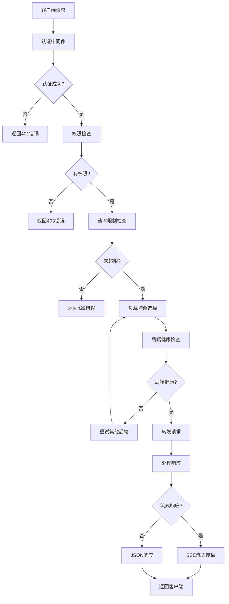

# 🏛️ 架构设计

Berry API 采用模块化架构设计，由5个核心模块组成：

```
┌─────────────────────────────────────────────────────────────────┐
│                        Berry API Gateway                        │
├─────────────────┬─────────────────┬─────────────────┬───────────┤
│   berry-api     │  berry-relay    │ berry-loadbalance│berry-core │
│   Web服务层     │   请求转发层    │   负载均衡层     │  核心库   │
│                 │                 │                 │           │
│ • HTTP路由      │ • 请求转发      │ • 后端选择      │ • 配置管理│
│ • 认证中间件    │ • 流式处理      │ • 健康检查      │ • 认证系统│
│ • 静态文件      │ • 错误处理      │ • 指标收集      │ • 共享类型│
│ • 管理接口      │ • 协议适配      │ • 策略实现      │ • 工具函数│
└─────────────────┴─────────────────┴─────────────────┴───────────┘
                                │
                    ┌───────────┴───────────┐
                    │      berry-cli        │
                    │     命令行工具        │
                    │                       │
                    │ • 配置验证            │
                    │ • 健康检查            │
                    │ • 指标查看            │
                    │ • 后端测试            │
                    └───────────────────────┘
```

### 🔄 请求处理流程



### 🧩 核心组件

| 组件 | 功能 | 技术栈 |
|------|------|--------|
| **berry-api** | Web服务层，提供HTTP API | Axum, Tower |
| **berry-relay** | 请求转发层，处理上游请求 | Reqwest, Tokio |
| **berry-loadbalance** | 负载均衡层，实现选择策略 | 自研算法, Metrics |
| **berry-core** | 核心库，配置和认证管理 | Serde, TOML |
| **berry-cli** | 命令行工具，运维管理 | Clap, 配置验证 |
